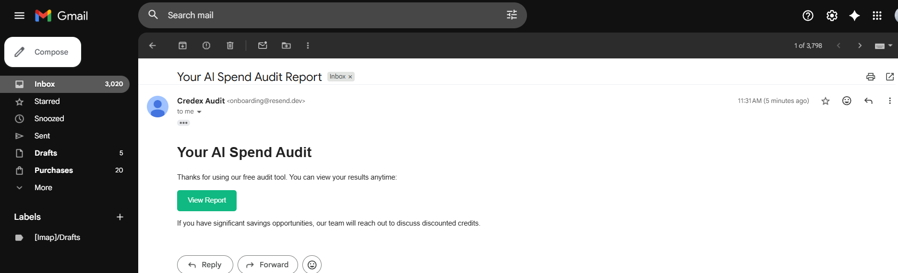

# AI Spend Audit

A free tool that helps startups identify overspending on AI tools and suggests cheaper alternatives or discounted credits via Credex.  
Built for the Credex Web Development Intern Assignment.

## Demo

**30‑second walkthrough (Loom):**  
[Watch the demo](https://www.loom.com/share/88116e88ecbc4c2f95734ef8378fbada)

## Email confirmation


_Replace with actual screenshots or a 30‑second screen recording link (YouTube/Loom)._

## Quick Start

```bash
# Clone the repo
git clone https://github.com/Vaish230/auditOps.git


# Install dependencies
npm install

# Set up environment variables
# Create a .env.local file and add your Supabase, OpenRouter, and Resend keys

# Start the dev server
npm run dev
```

Deploy: The easiest way is via Vercel. Connect the repo and set the environment variables in the Vercel dashboard.

**Live URL:** [https://auditops-flax.vercel.app/](https://auditops-flax.vercel.app/)

## Decisions

details:

- **Next.js App Router with TypeScript** - Enables server‑side data fetching for the audit results page and keeps the audit engine logic private.
- **Supabase as database** - Instant REST API, real‑time features if needed, and generous free tier. Avoids managing a separate Postgres instance.
- **Declarative audit engine** - All pricing and rules are defined in a single registry (`pricing.ts`). Adding a new tool requires only adding one object, no other code changes.
- **OpenRouter for AI summary** - Free tier, no credit card required, and easy fallback to a deterministic template. Works without any paid API.
- **localStorage for form persistence** - Avoids server‑side session management, keeps the form resilient to page reloads, and respects user privacy until they explicitly share their email.
